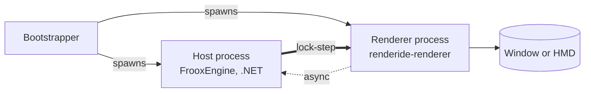
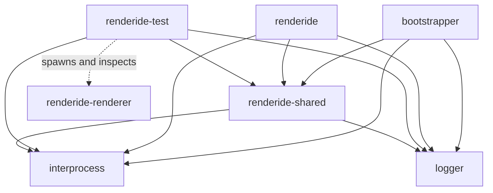
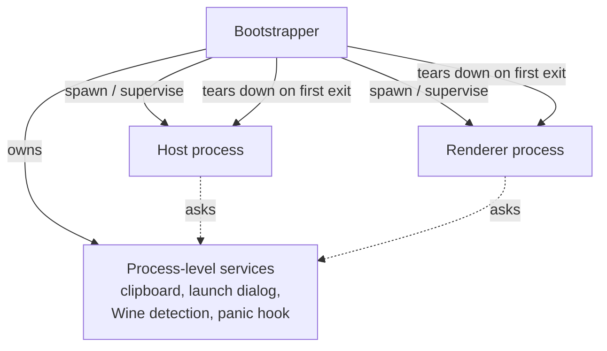
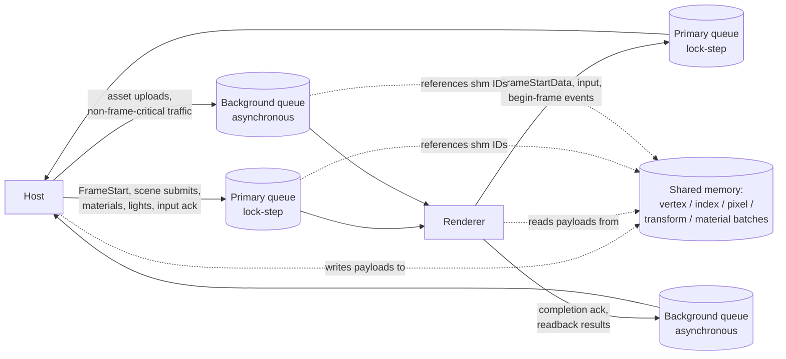
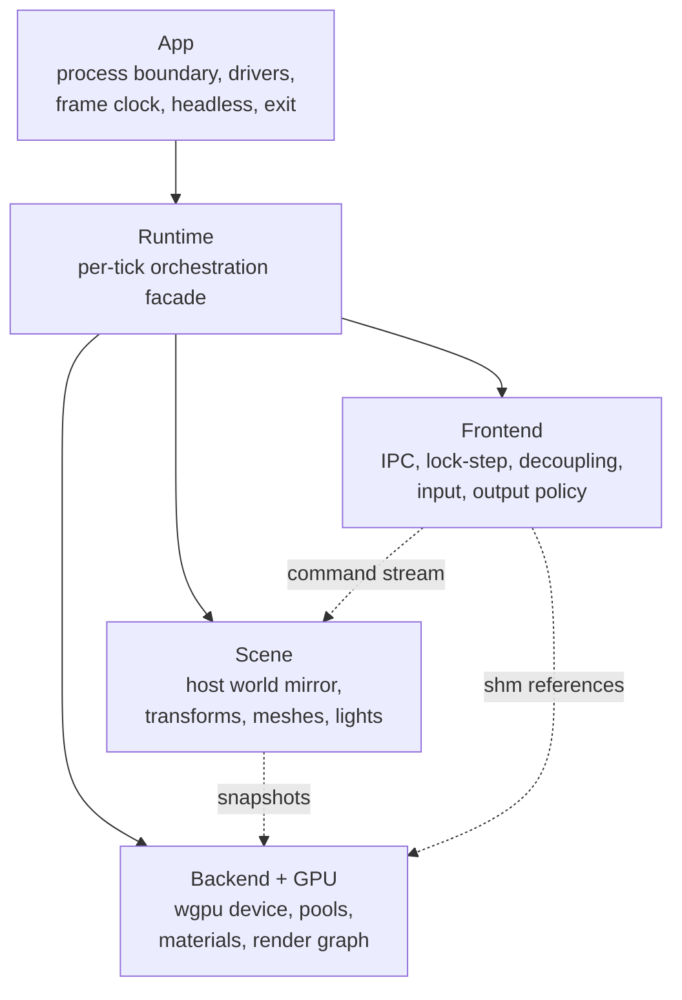
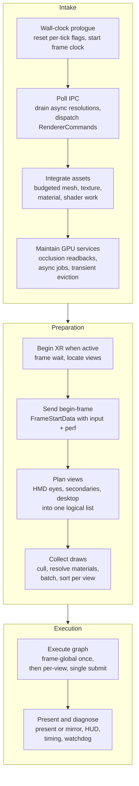
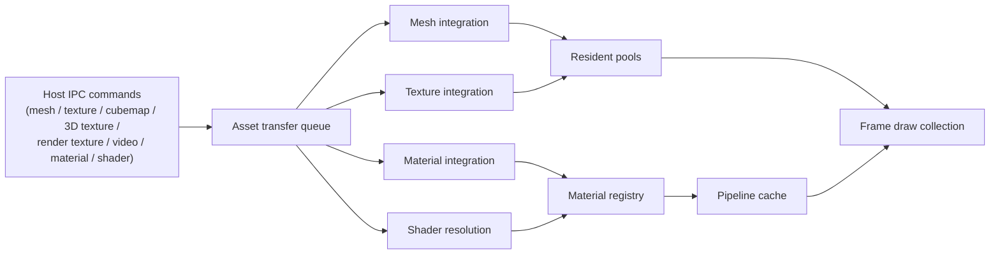
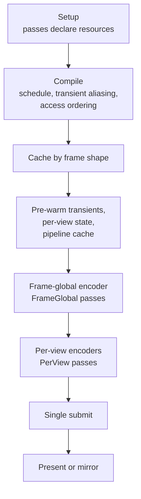
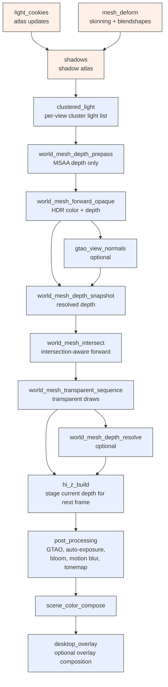
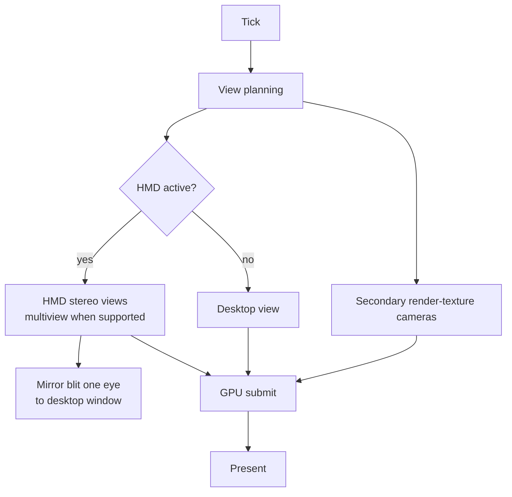

# Contributing to Renderide

This document is a long-form guide for people who want to work on the Renderide renderer. It assumes you can build the workspace already (if not, [`README.md`](README.md) covers prerequisites, build commands, and how to run the renderer end-to-end). The point of this guide is to give you the conceptual map you need to make changes that fit the codebase, whether you are fixing a small bug, porting a shader, adding a render pass, or rebuilding a subsystem.

The guide is structured as a difficulty ramp. Part 1 is for everyone. Part 2 is for people who plan to send a pull request. Part 3 is the architecture deep dive aimed at graphics programmers. Part 4 walks through the specific rendering techniques the codebase uses today. Each part has more, narrower subsections than the one before it, so you can stop wherever you have what you need.

You do not have to read straight through. The table of contents below is the map.

## Table of contents

- [Part 1: The basics](#part-1-the-basics)
  - [1.1 What Renderide is](#11-what-renderide-is)
  - [1.2 The mental model](#12-the-mental-model)
  - [1.3 Repository layout](#13-repository-layout)
- [Part 2: Working in the repo](#part-2-working-in-the-repo)
  - [2.1 The Rust workspace](#21-the-rust-workspace)
  - [2.2 The C# projects](#22-the-c-projects)
  - [2.3 Top-level files and folders](#23-top-level-files-and-folders)
  - [2.4 Build profiles and feature flags](#24-build-profiles-and-feature-flags)
  - [2.5 Running tests](#25-running-tests)
  - [2.6 Lints and formatting](#26-lints-and-formatting)
  - [2.7 Code conventions](#27-code-conventions)
  - [2.8 Logging and the diagnostics overlay](#28-logging-and-the-diagnostics-overlay)
  - [2.9 Continuous integration](#29-continuous-integration)
- [Part 3: The renderer architecture](#part-3-the-renderer-architecture)
  - [3.1 The three-process model](#31-the-three-process-model)
  - [3.2 IPC: queues and shared memory](#32-ipc-queues-and-shared-memory)
  - [3.3 The shared types crate](#33-the-shared-types-crate)
  - [3.4 The renderer's internal layers](#34-the-renderers-internal-layers)
  - [3.5 The frame lifecycle](#35-the-frame-lifecycle)
  - [3.6 The scene model](#36-the-scene-model)
  - [3.7 The asset pipeline](#37-the-asset-pipeline)
  - [3.8 The material system](#38-the-material-system)
  - [3.9 The render graph](#39-the-render-graph)
  - [3.10 Pass implementations](#310-pass-implementations)
  - [3.11 Planned views and presentation](#311-planned-views-and-presentation)
  - [3.12 OpenXR integration](#312-openxr-integration)
  - [3.13 The headless test harness](#313-the-headless-test-harness)
- [Part 4: Graphics deep dive](#part-4-graphics-deep-dive)
  - [4.1 Reverse-Z depth and projection](#41-reverse-z-depth-and-projection)
  - [4.2 Multiview stereo rendering](#42-multiview-stereo-rendering)
  - [4.3 The VR mirror invariant](#43-the-vr-mirror-invariant)
  - [4.4 Mesh skinning and blendshape compute](#44-mesh-skinning-and-blendshape-compute)
  - [4.5 Visibility and Hi-Z occlusion](#45-visibility-and-hi-z-occlusion)
  - [4.6 Clustered forward lighting](#46-clustered-forward-lighting)
  - [4.7 Image-based lighting](#47-image-based-lighting)
  - [4.8 Reflection probes and SH2 projection](#48-reflection-probes-and-sh2-projection)
  - [4.9 Skybox families](#49-skybox-families)
  - [4.10 The HDR scene-color chain](#410-the-hdr-scene-color-chain)
  - [4.11 ACES tone mapping](#411-aces-tone-mapping)
  - [4.12 AgX tone mapping](#412-agx-tone-mapping)
  - [4.13 Bloom](#413-bloom)
  - [4.14 GTAO ambient occlusion](#414-gtao-ambient-occlusion)
  - [4.15 Auto-exposure](#415-auto-exposure)
  - [4.16 Motion blur](#416-motion-blur)
  - [4.17 MSAA depth and color resolves](#417-msaa-depth-and-color-resolves)
  - [4.18 Display blit and final composition](#418-display-blit-and-final-composition)
  - [4.19 The shader source tree](#419-the-shader-source-tree)
  - [4.20 Naga-oil composition](#420-naga-oil-composition)
  - [4.21 Bind group conventions](#421-bind-group-conventions)
  - [4.22 Pipeline state vs shader uniforms](#422-pipeline-state-vs-shader-uniforms)
  - [4.23 The pass directive system](#423-the-pass-directive-system)
  - [4.24 GPU resource pools and budgeting](#424-gpu-resource-pools-and-budgeting)
  - [4.25 Frame resource management](#425-frame-resource-management)
  - [4.26 The driver thread and queue access gate](#426-the-driver-thread-and-queue-access-gate)
  - [4.27 Profiling with Tracy](#427-profiling-with-tracy)
- [License](#license)

---

## Part 1: The basics

### 1.1 What Renderide is

Renderide is a Rust renderer built on [wgpu](https://wgpu.rs/) that replaces the default Unity-based renderer used by [Resonite](https://store.steampowered.com/app/2519830/Resonite/). Resonite's game engine, FrooxEngine, runs in a separate .NET process and tells Renderide what to draw over a shared-memory IPC channel. Renderide owns the window, the GPU device, the OpenXR session, and the present loop. FrooxEngine owns everything else.

The project's goals shape almost every design decision:

- Cross-platform parity. Linux, macOS, and Windows are first-class targets. iOS and Android are not built yet, but the architecture is kept portable so that work doesn't start from a dead end.
- A data-driven render graph. Passes, materials, and resources route through shared systems instead of one-off code paths.
- No per-frame allocations on the hot path. Pools and frame-resource managers absorb the churn.
- OpenXR-first VR. Stereo rendering and head-tracked input are part of the core path, not an add-on.
- Profiling-friendly. Tracy CPU and GPU instrumentation is built in and zero cost when disabled.
- Safe by default. Library code avoids `unwrap`, `expect`, and `panic!`. `unsafe` is restricted to FFI shims and a small number of justified hot paths.

What Renderide is not: it is not a game engine, it does not own world state, it does not load asset bundles, and it does not have a scene editor. The host owns those concerns. The renderer is a comparatively narrow piece of software that takes a stream of commands describing a scene and produces pixels.

### 1.2 The mental model

Three processes cooperate to render a frame.



The bootstrapper launches the other two and ties their lifetimes together. The host runs simulation and tells the renderer what should appear on screen. The renderer mirrors the host's request into local state, decides what views need to be drawn, runs a compiled render graph, and presents the result. Input flows back the other direction so the host can advance simulation for the next frame.

Two ideas are worth holding onto from the start:

1. The host is authoritative. If the renderer is doing something "smart" about world state, ask whether the host should be telling it that instead.
2. The host and renderer agree, once per frame, that they are now in frame N. This handshake is called lock-step. It is the heartbeat of the system and the natural place to anchor everything per-tick.

### 1.3 Repository layout

The repository is a workspace that mixes a Rust workspace, a .NET solution, a separate host mod, a body of WGSL shader source, vendored native libraries, and a small set of runtime assets. Conceptually it splits into six regions:

- The Rust workspace under `crates/` is where the renderer, the launcher, the IPC transport, the logger, the shared-types crate, and the headless test harness live.
- The .NET solution under `generators/` produces a Rust source file that both the renderer and any host-side tooling depend on. `Generators.sln` ties together the generator and its tests.
- `RenderideMod/` is a separate C# project that injects renderer-aware behavior into the live host. It is not part of `Generators.sln`.
- The shader source tree under `crates/renderide/shaders/` holds all WGSL. It is large enough and important enough to deserve its own region.
- The runtime asset tree under `crates/renderide/assets/` holds files the renderer ships with at run time, including OpenXR controller binding profiles and the skybox model.
- `third_party/` holds vendored native libraries, currently the OpenXR loader.

Everything above the workspace root that is not one of these regions is contributor-facing project metadata: `Cargo.toml`, `.taplo.toml`, `clippy.toml`, `.pre-commit-config.yaml`, `.gitignore`, `.gitattributes`, `LICENSE`, `README.md`, `SECURITY.md`, the GitHub issue templates, Dependabot configuration, GitHub Actions workflows, and the static-site files.

---

## Part 2: Working in the repo

### 2.1 The Rust workspace

The workspace lists six member crates in `Cargo.toml`. Each has a single, focused job.

| Crate | Kind | Purpose |
| --- | --- | --- |
| [`bootstrapper`](crates/bootstrapper) | binary plus library | Launches the host and the renderer, runs the bootstrap IPC loop, bridges process services such as clipboard access and the desktop-versus-VR launch dialog, and ties child process lifetimes together. |
| [`interprocess`](crates/interprocess) | library | Cloudtoid-compatible shared-memory ring queues and semaphores. The transport every IPC channel rides on. Cross-platform mmap on Unix, named file mappings on Windows. |
| [`logger`](crates/logger) | library | File-first logger shared by every process. Writes to `logs/<component>/<timestamp>.log` under the runtime-selected log root, with a `RENDERIDE_LOGS_ROOT` override. |
| [`renderide-shared`](crates/renderide-shared) | library | The host-renderer wire-format crate. Holds the generated shared types, the binary packing helpers, the dual-queue IPC wrappers (one for the host side, one for the renderer side), and the shared-memory accessor and writer. |
| [`renderide`](crates/renderide) | two binaries plus library | The renderer itself. Owns winit, wgpu, OpenXR, the scene model, the render graph, materials, assets, profiling, and diagnostics. Builds the `renderide-renderer` binary (the renderer process) and the `roundtrip` binary (a small CLI used by the .NET generator's roundtrip tests to validate that Rust packing and C# packing agree on the bytes). |
| [`renderide-test`](crates/renderide-test) | binary plus library | Headless integration harness. Acts as a minimal host, drives the real IPC protocol, spawns the renderer, captures its output, and validates the result against golden images and golden state machines. |

`bootstrapper`, `interprocess`, and `logger` know nothing about graphics. `renderide-shared` knows nothing about graphics either. The graphics knowledge is concentrated in `renderide`. `renderide-test` deliberately does not link the renderer crate; it spawns `renderide-renderer` and validates it through the same IPC contract a real host would use.



### 2.2 The C# projects

Two .NET projects sit next to the Rust workspace and are joined by `Generators.sln` at the repo root. `RenderideMod` is a third C# project, but it is independent from that solution.

- [`generators/SharedTypeGenerator`](generators/SharedTypeGenerator) is a code generator. Its job is to read the canonical C# definitions of the host-renderer wire types and emit `crates/renderide-shared/src/shared.rs`, which both sides of the IPC then agree on. Internally it is structured like a small compiler: an `Analysis` stage that parses the inputs, an `IR` stage that holds the typed intermediate representation, an `Emission` stage that writes Rust, and an `Options` stage that handles CLI configuration. The entry point is `Program.cs`, with `GeneratorRunner.cs` and a small `Logging/` directory completing the host plumbing.
- [`generators/SharedTypeGenerator.Tests`](generators/SharedTypeGenerator.Tests) is the test project for the generator. It splits into `Unit/` tests for the generator's internal stages and `Roundtrip/` tests that pack a value with the generated C# packing code, then unpack it with the Rust `roundtrip` binary, then re-pack and re-check, asserting that both sides agree on every byte for every shape of every type the generator emits. Roundtrip sources compile only when `Renderite.Shared.dll` is discoverable through the test project's configured probe paths or environment variables; hosted CI runs the generator tests without those sources.
- [`RenderideMod`](RenderideMod) is a separate `net10.0` Resonite mod that hooks into the live host using HarmonyLib and ResoniteModLoader. It contains a `Patches/` folder for Harmony patches, an `Ipc/` folder for the host-side IPC plumbing the patches use, and a `Properties/` folder for assembly metadata. It is not a renderer dependency; it is the host-side counterpart that knows about Renderide and prepares the host to talk to it.

The .NET solution is built and tested by the shared CI workflow (see [2.9](#29-continuous-integration)). You do not need a .NET SDK installed to build or run the renderer itself, only when you change the generator or the mod.

### 2.3 Top-level files and folders

| Path | What it is |
| --- | --- |
| `Cargo.toml` | Rust workspace manifest. Lists the member crates, customizes the `dev` and `release` profiles, and centralizes the project's clippy and rustc lint configuration. |
| `Cargo.lock` | Resolved dependency lockfile. Checked in so all builds (and CI runners) agree. |
| `Generators.sln` | .NET solution file for `generators/SharedTypeGenerator` and `generators/SharedTypeGenerator.Tests`. |
| `clippy.toml` | Per-crate clippy tuning. Allows `unwrap`, `expect`, `panic`, `dbg`, `print`, and indexing in tests. |
| `.pre-commit-config.yaml` | Local pre-commit and pre-push hook definitions. |
| `.taplo.toml` | TOML formatter configuration, scoped to manifests so build output under `target/` is not formatted. |
| `.gitignore`, `.gitattributes` | Standard git configuration. |
| `LICENSE` | Project license. |
| `README.md` | User-facing build, run, feature, and profiling guide. |
| `SECURITY.md` | Supported-version and vulnerability-reporting policy. |
| `crates/` | The Rust workspace member crates. |
| `generators/` | The C# code generator and its tests. |
| `RenderideMod/` | The C# Resonite mod. |
| `third_party/` | Vendored native libraries. Currently holds the OpenXR loader, which the renderer's build script copies onto Windows and macOS targets so the loader is available next to the binary. |
| `.github/workflows/` | CI, CodeQL, release, and static-site deployment workflows. |
| `.github/ISSUE_TEMPLATE/`, `.github/dependabot.yml` | GitHub issue forms and dependency-update configuration. |
| `index.html`, `robots.txt`, `sitemap.xml`, `renderide_whitepaper/` | Static site and whitepaper content. |

Inside the renderer crate at `crates/renderide/`, three top-level companions live next to `src/`:

- `assets/` holds runtime assets that ship with the renderer: the OpenXR action and binding files under `xr/` plus `models/skybox.glb`. The build script copies the XR action and binding files into the artifact directory so the binary can find them at run time.
- `shaders/` holds every WGSL source file the renderer compiles. It is divided into `materials/` (one shader per host material program), `modules/` (shared logic composed via naga-oil), and `passes/` with subdirectories for `backend/`, `compute/`, `post/`, and `present/` shaders.
- `build.rs` and `build_support/` together compose the WGSL source tree at build time, generate the runtime shader package under the Cargo artifact directory, copy XR assets into the artifact directory, and copy the vendored OpenXR loader on Windows and macOS. The `build_support/shader/` subdirectory is where the shader composition logic lives, broken into `source`, `modules`, `compose`, `directives`, `validation`, `parallel`, `mirror_once`, `emit`, `model`, and `error`.

### 2.4 Build profiles and feature flags

The workspace customizes two profiles in `Cargo.toml`:

- `dev` raises the default development optimization level to 1, keeps incremental compilation on, uses many codegen units, and emits line-table debug info so routine debug builds run faster while retaining assertions.
- `release` raises optimization to 3, disables incremental compilation and debug assertions, uses one codegen unit, enables thin LTO, emits line-table debug info, strips debuginfo from the final binaries, and keeps unwind panics.

The `renderide` crate declares two opt-in Cargo features. Both are off by default to keep stock builds and CI lean.

- `tracy` enables Tracy profiling. CPU spans come from the `profiling` crate. GPU timestamp queries come from `wgpu-profiler`. The Tracy client links statically and runs in on-demand mode, so a profiled build idles near zero cost when no GUI is connected.
- `video-textures` enables GStreamer-backed video texture decoding. Without this feature, the renderer still accepts video texture IPC commands and allocates GPU placeholders, but no decoding runs and the placeholder stays black. On Linux, install `libgstreamer1.0-dev`, `libgstreamer-plugins-base1.0-dev`, and `libgstreamer-plugins-good1.0-dev`; the last package provides the `videoflip` element used to land decoded frames in the texture orientation shaders expect.

See `README.md` for the exact build commands and platform-specific dependencies for each feature.

### 2.5 Running tests

Tests live in three places.

- Unit tests live in `mod tests` blocks at the bottom of the file they test.
- Per-crate integration tests live in `crates/<crate>/tests/`. Each file in a `tests/` directory is its own integration test binary linked against the crate's library API.
- Cross-process integration tests live in `crates/renderide-test/`, which builds a full host emulator and drives the real IPC contract end to end.

The renderer crate carries a curated set of integration tests under `crates/renderide/tests/` that cover non-GPU concerns. The current set asserts architecture-layer boundaries, OpenXR loader artifact handling, the parallel shader build, clustered-light shader layout, GPU instrumentation coverage, reflection-probe source resolution, terminal error mirroring on Unix, material UV-orientation rules, native stdio forwarding, and shader-module composition correctness. None of these require a GPU adapter.

The supporting crates each have their own integration tests:

- `crates/bootstrapper/tests/` covers stale artifact cleanup, the public CLI surface (`cli_public_surface.rs`), and the IPC queue tempdir lifecycle (`ipc_queues_tempdir.rs`).
- `crates/interprocess/tests/` exercises a publisher-subscriber queue end to end (`end_to_end.rs`).
- `crates/logger/tests/` covers per-component init layouts, append-versus-truncate semantics, malicious-timestamp sanitization, mirror writers, the log facade, the macros routed through `init_for_*`, second-init no-op behavior, the uninitialized state, and concurrency under torn-line conditions.
- `crates/renderide-shared/tests/` covers wire packing for polymorphic types (`packing_polymorphic_roundtrip.rs`) and primitives (`packing_wire_primitives.rs`), plus the singleton claim that prevents two renderers from racing on the same IPC name (`renderer_singleton_claim.rs`).
- `crates/renderide-test/tests/` covers the harness itself: golden-image diff writing, golden round-trips, log folder routing, the PNG stability state machine, the spawn argument table, an end-to-end sphere pipeline, and the current scene integration test binaries (`unlit_sphere` and `torus_unlit_perlin`). The tracked golden cases also include `alpha_cutout_masked_quads`, `multi_primitive_unlit_grid`, and `pbs_lit_material_matrix`.

Ordinary renderer integration tests should stay non-GPU unless they belong in the dedicated harness. GPU-backed validation lives in `renderide-test`, which CI runs as a headless golden-image suite:

```bash
cargo run -p renderide-test -- check-suite
cargo run -p renderide-test -- update-suite
cargo run -p renderide-test -- check-suite --case unlit_sphere
```

Use `update-suite` only when the visual change is intentional. The flat-image gate rejects clear-only captures so a broken render cannot silently promote itself.

If the renderer binary is not already present next to the harness, build it first with `cargo build -p renderide` or pass an explicit binary with `--renderer`.

### 2.6 Lints and formatting

The workspace puts a heavy lint configuration at the workspace level so every crate inherits it. The intent is that code which lands in this repo holds itself to a consistent standard regardless of which crate it lives in.

The Rust lint set includes (among many others):

- `missing_docs` warns on undocumented public items.
- `unsafe_op_in_unsafe_fn` and `missing_unsafe_on_extern` enforce explicit unsafe scoping.
- `keyword_idents_2024` and several Rust 2024 hygiene lints keep the codebase aligned with the current edition.

The clippy set includes:

- `unwrap_used`, `expect_used`, `panic`, `todo`, `unimplemented`, `print_stdout`, `print_stderr`, `dbg_macro`, `mem_forget`. The expectation is that runtime and library paths do not panic, do not leak through `mem::forget`, and route output through the logger.
- `mod_module_files` enforces the `module_name.rs` plus `module_name/` layout instead of the older `mod.rs` style.
- `undocumented_unsafe_blocks` requires a `// SAFETY:` comment on every `unsafe` block.
- A long list of style and correctness lints (`uninlined_format_args`, `needless_pass_by_ref_mut`, `redundant_clone`, `large_stack_arrays`, `await_holding_lock`, `significant_drop_in_scrutinee`, `manual_clamp`, and so on) that catch the kind of paper cuts that compound across a large codebase.

`clippy.toml` allows the panic-and-unwrap family of lints inside test and benchmark code so tests can assert directly without ceremony. Production code still inherits the workspace lint set.

Format with `cargo fmt --all` for Rust, `taplo fmt` for `Cargo.toml` and other manifests, and `dotnet format` for the C# projects.

The repository also provides local hooks through `pre-commit`. Install both stages once per clone:

```bash
pre-commit install --hook-type pre-commit --hook-type pre-push
```

The `pre-commit` stage catches Rust formatting, TOML formatting, and Clippy failures before a commit is created. The `pre-push` stage runs [`scripts/ci/pre-push-check.sh`](scripts/ci/pre-push-check.sh), which mirrors the same-machine parts of hosted CI: Rust formatting, Taplo, strict Clippy, Rust build/test, and the .NET generator restore/build/test path. On Linux it runs Rust Clippy with `--all-features`; on Windows and macOS it checks the `tracy` feature instead, matching the hosted matrix split.

### 2.7 Code conventions

A few conventions are worth spelling out because the lint configuration assumes them.

- The project targets the Rust 2024 edition.
- Modules use `module_name.rs` next to a `module_name/` directory, never `mod.rs`.
- Errors use explicit `thiserror` enums. There is no `anyhow` dependency.
- Library and runtime code does not use `unwrap`, `expect`, or `panic!`. Tests, build scripts, and one-shot startup paths can use them when failure is unrecoverable by design.
- `unsafe` is restricted to FFI shims and explicitly justified hot paths. Every `unsafe` block carries a `// SAFETY:` comment that names the invariant it depends on.
- Public items carry `///` doc comments. Inline `//` comments are reserved for the non-obvious why.
- Output goes through the `logger` crate. `println!` and `eprintln!` are clippy-warned everywhere.
- Collections default to `hashbrown::HashMap`. Locks default to `parking_lot::Mutex`.
- Dependency versions follow the style already used in the relevant manifest. Prefer current stable releases, avoid overly broad version requirements, and justify new dependencies tightly.
- Follow the AI contribution policy in `README.md` and the vulnerability reporting policy in `SECURITY.md`.

For C# code in the generator and the mod: throw specific exception types instead of catching `Exception` at internal boundaries, and keep public types documented.

### 2.8 Logging and the diagnostics overlay

The renderer has two complementary visibility systems.

The first is the file-first logger from the `logger` crate. Rust processes initialize it on startup and write to their own subdirectory under the runtime-selected log root. Local checkout runs prefer `Renderide/logs`; release binaries use the current user's platform log directory unless `RENDERIDE_LOGS_ROOT` is set. The Rust logger component names are `bootstrapper`, `host` (captured host stdout and stderr), `renderer`, and `renderer-test`. The C# generator uses its own aligned logging helper and writes under `logs/SharedTypeGenerator`. Log files are named with a UTC timestamp so they sort and can be compared across runs. The recommended levels are `error` for unrecoverable failures, `warn` for recoverable anomalies, `info` for lifecycle events, `debug` for per-frame and per-asset control flow (the default), and `trace` for tight loops and high-frequency paths.

The second is the in-renderer diagnostics overlay built with Dear ImGui. It surfaces per-frame timings, per-view information, scene and asset inspection, host process metrics, encoder errors, and a watchdog. The overlay reads from snapshots captured at layer boundaries rather than borrowing live state from the renderer, which keeps the overlay safe to run alongside the per-frame work it is observing.

### 2.9 Continuous integration

The main check workflow lives under `.github/workflows/`.

The current workflows are:

- `ci.yml` builds and tests the Rust workspace and the .NET generator solution as independent jobs. The Rust matrix runs on Ubuntu, Windows, and macOS; Linux is the only entry that uses `--all-features`, because GStreamer dev packages are reliably installable from the system package manager only on Linux. Windows and macOS still check the `tracy` feature so it stays warning-free on those platforms. The Rust job checks formatting, Taplo, Clippy, targeted package builds, the full workspace test suite, and the headless renderer golden suite. The .NET job uses the .NET 10 SDK on Ubuntu, Windows, and macOS, restores `Generators.sln` in locked mode, verifies formatting on Linux only, builds `SharedTypeGenerator.Tests` with warnings as errors, and runs its tests. Hosted runners do not have `Renderite.Shared.dll`, so generator roundtrip sources are excluded there.
- `codeql.yml` runs CodeQL analysis for GitHub Actions, C#, and Rust on pushes and pull requests that target `master`, plus a weekly schedule.
- `release.yml` builds nightly or manually requested release artifacts from the newest green CI run on `master`.
- `static.yml` deploys the static site to GitHub Pages when the site files change on `master` or when manually dispatched.

The CI workflow triggers on push to `master`, on pull requests, and on manual dispatch, but push and pull-request runs are path-filtered to files that affect builds, tests, or generated artifacts.

Local hooks catch failures before a push, but they are not the final gate because any git hook can be bypassed with `--no-verify`. Protect `master` with a GitHub branch protection rule or ruleset that requires pull requests and these status checks before merge:

- `Rust / ubuntu-latest`
- `Rust / windows-latest`
- `Rust / macos-latest`
- `.NET / ubuntu-latest`
- `.NET / windows-latest`
- `.NET / macos-latest`

Block force pushes and branch deletion on `master` so the hosted CI result remains the authoritative merge gate.

---

## Part 3: The renderer architecture

### 3.1 The three-process model

Renderide's launcher process is `renderide`, built by the `bootstrapper` crate. The renderer process it supervises is `renderide-renderer`, built by the `renderide` crate. Together with the host they form a three-process system: the bootstrapper owns lifetimes, the host owns the world, and the renderer owns the GPU and the window. The mental-model diagram in [1.2](#12-the-mental-model) shows the topology. What is worth picking apart in this section is *what the bootstrapper does that nothing else can*, because the bootstrapper is easy to forget and easy to misuse.



A few invariants are worth knowing up front:

- The bootstrapper is the only process that knows about both ends. The host and the renderer never spawn each other directly.
- The bootstrapper bridges OS-level services that should not live inside a renderer: the desktop-versus-VR launch dialog, the clipboard, Wine detection on Linux, panic hook installation. It also detects when the renderer has died first (for example, because the user closed the window) and tears the host down with it.
- The renderer can also run without the host, either standalone (no IPC) or under the headless test harness. All three modes share the same architectural paths.

### 3.2 IPC: queues and shared memory

Two queues plus one shared-memory region make up the contract between host and renderer.



The primary queue carries per-frame control flow: frame begin and end, scene submits, lights, materials, input acknowledgements. Both sides drain it as part of the lock-step exchange that gates frame cadence. The background queue carries asynchronous traffic: large asset uploads, completion acknowledgements, readback results. The renderer integrates background traffic on its own clock, with a budget per tick so the frame stays responsive while the host catches up.

Queue messages are small and reference shared-memory regions by ID. Shared memory is where the bulk lives: vertex and index data, texture pixels, transform batches, material property batches. The host writes; the renderer reads. Lifetime is governed by the IPC protocol so the renderer never reads a region the host has freed.

The transport layer is the `interprocess` crate, which implements Cloudtoid-compatible shared-memory ring queues. On Unix it backs queues with file mappings under a configurable directory (defaulting to `/dev/shm/.cloudtoid/interprocess/mmf` on Linux), with `RENDERIDE_INTERPROCESS_DIR` available as an override. On Windows it uses named file mappings and named semaphores. Queue parameters are passed by CLI; both sides agree on the same names by sharing the same configuration.

### 3.3 The shared types crate

Wire compatibility lives in `renderide-shared`. The crate is structured around five concerns:

- `shared` is the generated module containing every type that crosses the host-renderer boundary. It is generated by the C# `SharedTypeGenerator` and should never be edited by hand. To change the wire format, change the generator's input or the generator itself, then regenerate.
- `packing` is the binary contract: a `MemoryPacker` and `MemoryUnpacker` plus the supporting traits that turn typed values into bytes and back. There is also a small `extras` submodule with hand-rolled packing for types whose layout the auto-classifier cannot derive.
- `buffer` describes shared-memory regions in a way both sides understand.
- `wire_writer` is the host-side helper for emitting bytes onto a shared-memory region.
- `ipc` carries the dual-queue wrapper used by the renderer (`DualQueueIpc`), the matching host-side wrapper (`HostDualQueueIpc`), the read-only shared-memory accessor used by the renderer, and the shared-memory writer used by the host.

A small `test_hooks` module exposes injection points the integration suites use to simulate hostile or partial inputs. Because anything that crosses the process boundary lives in this crate, neither the renderer nor the host has to depend on the other's heavy dependencies (wgpu, naga, OpenXR, winit, imgui on the renderer side; the .NET runtime on the host side). The generator's output (`crates/renderide-shared/src/shared.rs`) is the one file that ties C# definitions to Rust consumers, and it flows downstream into `renderide`, `renderide-test`, and any future host-side Rust tooling.

### 3.4 The renderer's internal layers

The `renderide` crate is organized around architectural layers plus renderer subsystems that hang off the backend and graph boundary. The split is the contract that lets the renderer run with or without a host, with or without a window, and under the test harness.



The main top-level modules in `crates/renderide/src/` are:

- `app` owns the process boundary: startup bootstrap, logging and crash hooks, service installation, winit and headless drivers, frame clock, window icon handling, redraw planning, and process exit codes.
- `frontend` owns host transport and frame cadence: IPC transport, init and lock-step state, decoupling, command dispatch, begin-frame data, input conversion, output-device policy, session summaries, and frame-start performance tracking.
- `scene` owns the host world mirror. It tracks worlds and render spaces, dense transforms, static and skinned mesh renderables, lights, LOD groups, overrides, cameras, camera portals, render buffers, reflection-probe requests, poses, layers, and blit-to-display state. There is no wgpu in here.
- `assets` owns CPU-side asset decoding and integration queues for mesh, texture, shader, and video payloads. `backend/asset_transfers` owns the GPU-facing upload plans and reliable acknowledgements that move those payloads into resident pools.
- `backend` owns the GPU-facing facade called by the runtime: frame-global GPU state, frame resources, asset transfers, async GPU jobs, light and cluster buffers, per-draw resources, shadow atlas settings, graph registration, world-mesh frame plans, and diagnostics snapshots.
- `gpu`, `gpu_pools`, and `gpu_resource` contain device and queue setup, adapter limits, driver-thread submission, presentation blits, VR mirror helpers, persistent resident pools, transient resource wrappers, and resource-cache plumbing.
- `materials`, `passes`, `render_graph`, `graph_inputs`, `render_phase`, `world_mesh`, `mesh_deform`, `occlusion`, `skybox`, `reflection_probes`, `camera`, and `particles` are the renderer subsystems that turn mirrored scene state into graph resources, draw packets, compute work, and presentation-ready output.
- `runtime` wires the other layers together one tick at a time. Its `frame` subtree handles view planning, extraction, scheduling, rendering, and submit; its `ipc`, `asset_integration`, `gpu_services`, `lockstep`, `xr_glue`, `offscreen_tasks`, and `debug_hud_frame` modules carry the per-tick side effects.

The arrows in the diagram are the allowed dependency directions. The architecture-layer test enforces concrete forbidden edges: frontend cannot reach assets, graph inputs, GPU, or XR; scene cannot reach backend; assets, materials, passes, render graph, graph inputs, and world mesh cannot reach back into backend or pass scheduling in ways that would invert the layer boundary. If you find yourself wanting an upward dependency (scene reaching into IPC, backend mutating frontend state), it is almost always a sign the data should move differently, usually as a snapshot taken at a layer boundary.

### 3.5 The frame lifecycle

Every tick walks through the same conceptual phases in the same order. The order is not arbitrary; it is what makes the per-tick contract between IPC, scene, GPU, and presentation work. The ten phases fall into three bands: an intake band that absorbs the host's traffic and runs maintenance, a preparation band that figures out what is going to be drawn, and an execution band that records the work and ships it.



A few things about why this order matters:

- IPC poll and asset integration happen before any GPU work so the rest of the tick sees the latest state.
- GPU service maintenance runs after asset integration so transient eviction and async jobs see the new uploads.
- XR pose acquisition runs before begin-frame so headset pose, input, and views all describe the same frame.
- Scene mutation is fully settled before draw collection. Collection reads from snapshots, not from live transport state.
- Graph execution consumes prepared per-view plans rather than reaching back into transport for live data during the per-view loop.

If you add new per-tick work, place it in the correct phase rather than carving out a new one.

### 3.6 The scene model

The scene layer is a typed projection of the IPC command stream. It mirrors the host's logical world state and exposes it to the backend through stable APIs.

What lives there:

- Render spaces, one per host-visible world partition. Each owns its own transforms, renderables, lights, skybox, and reflection probe state.
- Dense transform arenas keyed by host index, including the host's removal ordering. The dense layout is part of the wire contract: random reorderings would break alignment with what the host is sending.
- Mesh and skinned renderables, each carrying the mesh, material, transform, and per-instance overrides needed to draw it.
- Lights merged from frame submits and from light-buffer submissions.
- LOD groups that let draw collection choose the active renderer set from host-authored distance bands.
- Render and material-property overrides for per-camera filtering and per-instance tweaks.
- Skybox state, with the actual filtered cube cache living in the backend.
- Reflection probe task rows tracking host requests for SH2 projection.
- Cameras (including secondaries), poses, layers, and the `blit_to_display` description the runtime uses to route a scene's output to its final surface.
- Cached world matrices.

Two strict properties keep this layer honest:

1. There is no wgpu. The scene module compiles without the GPU dependency. If a GPU resource handle wants to be in scene state, that is the cue to instead pass the handle to the backend at the right boundary.
2. World matrices are scene-owned cached data. The backend asks for resolved matrices; it does not rebuild scene hierarchy logic inside GPU code.

### 3.7 The asset pipeline

Asset integration is cooperative, queue-backed, and budgeted. The host can send formats before data, data before GPU attach, multiple uploads for the same ID, and cancellations, and the renderer must keep up without dropping frames.



The relevant code lives in `crates/renderide/src/assets/`, structured around an asset transfer queue plus per-type integration subdirectories (`mesh/`, `texture/`, `shader/`, `video/`). The backend transfer workers handle the GPU-facing details for meshes, 2D textures, cubemaps, 3D textures, render textures, video textures, auxiliary assets, and host-authored catalogs such as material properties and sampler descriptors. The integration phase of the runtime tick (`runtime/asset_integration.rs`) drains these tasks under a time budget that shrinks when the renderer is decoupled from the host. Uploaded resources land in resident pools managed by `gpu_pools/` (see [4.24](#424-gpu-resource-pools-and-budgeting)) and become visible to draw collection on the same tick.

Each asset type has its own integration loop because each has different ordering invariants (formats before data, palettes before frames, mip levels independently uploadable, video decoding running on a worker), but they all share one property: the runtime tick decides when integration runs and how long it gets, not the host.

### 3.8 The material system

The material system is the most concept-dense part of the renderer because it sits at the crossroads of asset integration, shader compilation, pipeline state, and per-frame draw resolution.

The host writes material properties as a flat key-value store. Each property lands in exactly one of four places:

| Property kind | Examples | Resolved by | Lives in |
| --- | --- | --- | --- |
| Pipeline state | `_SrcBlend`, `_DstBlend`, `_ZWrite`, `_ZTest`, `_Cull`, `_Stencil*`, `_ColorMask`, `_OffsetFactor`, `_OffsetUnits` | Material blend mode and render state | Pipeline cache key (used to build `wgpu::RenderPipeline`) |
| Shader uniform value | `_Color`, `_Tint`, `_Cutoff`, `_Glossiness`, `*_ST` | Property store, packed by reflection | Material struct uniform at `@group(1) @binding(0)` |
| Shader uniform keyword | `_NORMALMAP`, `_ALPHATEST_ON`, `_ALPHABLEND_ON` (and the renderer-reserved `_RenderideVariantBits` bitmask that decodes them on the GPU) | Property store or inferred from material | Material struct uniform at `@group(1) @binding(0)` |
| Texture | `_MainTex`, `_NormalMap`, ... | Texture pools, bound by reflection | Material bindings at `@group(1) @binding(N)` |

The split is enforced. Pipeline-state property names must never appear in a shader's group 1 material uniform. They are dead weight there: shaders never read them, and the host writes them. The build script rejects any material WGSL that violates this contract. Two materials sharing a shader but differing in pipeline state correctly resolve to distinct cached pipelines because the cache key includes the resolved blend mode and render state.

The relevant code lives in `crates/renderide/src/materials/`. It is large enough to be worth a quick map: `system` is the materials-system entry point the backend talks to; `registry` is the central table; `host_data/` holds the property store; `cache` holds the pipeline cache; `router` maps host shader asset IDs to pipeline families or runtime shader package stems; `wgsl_reflect/` does naga-based reflection; `wgsl` carries the smaller WGSL helpers reflection needs; `raster_pipeline/` builds raster pipelines, with `null_pipeline.rs`, `pipeline_kind.rs`, `pipeline_build_error.rs`, and `pipeline_property_resolver.rs` as its companions; `material_passes/` carries the per-shader pass declarations parsed at build time and the tables that map them to pipeline kinds; `shader_permutation.rs` handles keyword permutations; `embedded/` holds compatibility shims for built-in shader package lookups; `render_state/` holds blend, depth, stencil, cull, and color mask state; `render_queue.rs` carries the queue ordering for opaque, alpha test, transparent, and overlay draws.

### 3.9 The render graph

The render graph is the renderer's per-frame compiler. Passes declare typed access to resources up front (imported frame targets, transient resources, persistent history resources), and the graph turns those declarations into a scheduled, recordable sequence of GPU work.



The relevant code lives in `crates/renderide/src/render_graph/`. The pieces:

- `builder/` is the setup-time API. Passes register their resource access and any per-pass parameters.
- `compiled/` is the immutable result: a flattened pass list in dependency order, transient usage unions, lifetime-based alias slots, the entry points (`execute` and `execute_multi_view`) that record encoders and submit them, and the memoization keyed on the durable frame-shape inputs (surface extent, MSAA, multiview, surface format, scene HDR format).
- `pass/` defines the typed pass traits that concrete passes implement: `RasterPass`, `ComputePass`, and `EncoderPass`.
- `pool/` manages the transient resource pool, and `upload_arena/` backs deferred buffer uploads.
- `resources/` and `compiled/helpers/frame_params.rs` carry the typed resource handles and per-frame parameter packs.
- `history/` carries the registry of persistent history resources (previous-frame depth, accumulator targets) that survive past a single tick.
- `post_process_chain/` declares the post-processing chain shape and signature. Per-view settings come from `config::types::post_processing`, so a planned view can carry its own chain spec.
- `record_parallel.rs` is the parallel record path that makes the per-view loop scale across cores.
- `frame_upload_batch/` coalesces deferred buffer writes into a single drain before submit.
- `gpu_cache/`, `blackboard.rs`, `context/`, `ids.rs`, `error.rs`, `schedule.rs`, `swapchain_scope.rs`, and `execution_backend.rs` provide the supporting machinery.

Two structural ideas matter most:

- Pass phase. The graph distinguishes `FrameGlobal` passes from `PerView` passes. Frame-global work runs once per tick (mesh deformation plus frame-global atlas work such as light cookies and shadows). Per-view work runs once per planned view (clustered lighting, world rendering, Hi-Z build for the current view's submitted depth, view-dependent post-processing, scene-color compose, and desktop overlay composition).
- Encoder topology. The executor records frame-global passes in a dedicated encoder, then one encoder per planned view for per-view passes. Deferred buffer writes are drained before the single submit. The per-view loop pre-warms transients, per-view per-draw resources, and the pipeline cache once across all views before recording, so the recording loop never pays lazy allocation costs (a structural prerequisite for the parallel record path).

When you find yourself tempted to record a pass on a borrowed encoder outside the graph, register a graph node instead. The graph is what keeps frame resource lifetimes correct.

### 3.10 Pass implementations

Concrete passes live in `crates/renderide/src/passes/`. Each implements one of the graph pass traits and registers against the graph builder.



The currently implemented passes:

- `LightCookieAtlasPass` updates the frame-global light-cookie atlas used by lighting.
- `mesh_deform` runs mesh skinning and blendshape compute (see [4.4](#44-mesh-skinning-and-blendshape-compute)).
- `ShadowAtlasPass` updates the frame-global shadow atlas before per-view lighting and world rendering.
- `clustered_light` runs the per-view compute pass that bins lights into clusters for this view's camera and eye layout (see [4.6](#46-clustered-forward-lighting)).
- `world_mesh_forward` is the workhorse forward family. It splits into a prepare step, an optional MSAA depth prepass, an opaque pass, optional GTAO view normals, a depth snapshot, an intersection-aware pass, the transparent sequence, optional depth resolve, and the color/depth snapshots that feed downstream effects. A `helpers/` module collects the shared utilities the forward pass and its siblings draw on; it is not itself a pass.
- `hi_z_build` builds and stages the hierarchical Z pyramid from the current resolved depth after forward rendering. Draw collection reads the previous frame's staged pyramid for temporal occlusion testing (see [4.5](#45-visibility-and-hi-z-occlusion)).
- `post_processing` is a family of effects, each of which is its own graph node: GTAO, auto-exposure, bloom, motion blur, and either ACES or AgX tone mapping. See sections [4.11](#411-aces-tone-mapping) through [4.16](#416-motion-blur).
- `scene_color_compose` copies the HDR scene color into the swapchain, the XR target, or an offscreen output, depending on the planned view. The final display blit (see [4.18](#418-display-blit-and-final-composition)) handles any color-space and resolution conversion past that point.
- `WorldMeshDesktopOverlayPass` composites desktop overlay output after the main scene-color compose step.

Swapchain clears no longer have a dedicated pass; clears happen through the render graph's load ops on the targets that own them, which keeps the cost in the same encoder as the work that follows.

### 3.11 Planned views and presentation

Each tick produces one logical list of views to render: the desktop target when no HMD is active, the HMD eye targets when one is, and any number of secondary cameras the host has requested (typically render textures driven by world cameras).



The relevant code lives in `crates/renderide/src/runtime/frame/view_planning.rs` and `view_plan.rs`, supported by `crates/renderide/src/camera/` (the `state`, `frame`, `view`, `projection`, `projection_plan`, `stereo`, `geometry`, and `secondary/` modules) and `crates/renderide/src/gpu/vr_mirror/` for the mirror blit. The final hop to the swapchain goes through `crates/renderide/src/gpu/display_blit/` (see [4.18](#418-display-blit-and-final-composition)), which handles any color-space or resolution mismatch between the composed scene color and the surface.

Two invariants are easy to violate and worth restating:

- The VR mirror is a blit, not a re-render. When the HMD path renders successfully, the desktop window shows a mirror copy of one HMD eye. Adding a separate desktop scene that runs alongside the HMD path is a bug, not a feature.
- Secondary cameras and render textures are first-class planned views. They go in the same planned-view list as desktop and HMD, render through the same graph, and (in a VR session) render alongside the HMD workflow.

### 3.12 OpenXR integration

OpenXR support lives in `crates/renderide/src/xr/`. It is structured around several concerns:

- `bootstrap/` brings up the OpenXR session.
- `app_integration/` integrates the XR session with the app driver and the per-tick frame lifecycle.
- `session/` carries the typed session state.
- `swapchain.rs` owns the XR swapchain images and view geometry.
- `input/` converts OpenXR action state into the same `InputState` shape that winit input is converted into.
- `host_camera_sync.rs` keeps the host's notion of camera in sync with the headset pose.
- `openxr_loader_paths.rs` and the vendored loader under `third_party/openxr_loader/` ensure the loader can be found at run time, especially on Windows and macOS where the build script copies the vendored loader next to the binary.
- `debug_utils.rs` wires up OpenXR debug callbacks for diagnostics.

The `HeadOutputDevice` adapter that bridges the host's notion of an output device to the XR present path now lives on the frontend side, as `frontend/output_device`, so the OpenXR layer can stay focused on session and swapchain concerns.

Controller bindings ship as TOML files under `crates/renderide/assets/xr/bindings/`. Each TOML maps an OpenXR interaction profile (Oculus Touch, Valve Index, HTC Vive, Vive Cosmos, Vive Focus 3, Pico Neo 3, Pico 4, HP Reverb, Microsoft Motion, Samsung Odyssey, Meta Touch Plus, Quest Touch Pro, KHR Simple, KHR Generic) to the action set the renderer requests. `actions.toml` defines the action set itself.

If OpenXR initialization or a per-frame acquire fails, the renderer should degrade through the desktop and secondary camera paths and keep the failure visible in diagnostics. The system does not crash when the headset disappears.

### 3.13 The headless test harness

`renderide-test` is a minimal host that drives the real IPC contract end to end without a real FrooxEngine. It is structured around:

- `cli` for command-line parsing.
- `host` for the host-side IPC plumbing.
- `scene` and `scene_dsl` for the scenes the harness can stage.
- `golden` for golden-image comparison and PNG diff writing.
- `logging` for the harness's own log routing.

The harness is what stands between "the renderer compiles" and "the renderer behaves." It exercises the same queues, the same shared-memory protocol, and the same renderer entry points a real launch would, then captures the rendered frames for comparison against golden references under `crates/renderide-test/goldens/`. The default renderer binary is resolved next to the harness binary; `--release` selects `target/release/renderide-renderer`, and `--renderer` can override the path entirely. New end-to-end integration tests for the renderer as a whole belong in this harness, not in `crates/renderide/tests/`.

---

## Part 4: Graphics deep dive

This part assumes you have read at least Part 3 or are comfortable diving in cold. Each subsection covers one technique or system at a conceptual level. The point is to give you the vocabulary and the mental model, not to walk you through specific code.

### 4.1 Reverse-Z depth and projection

Renderide uses a reverse-Z depth convention: the near plane maps to depth 1.0 and the far plane to depth 0.0. The projection math, depth comparison direction, and clear value all follow.

The motivation is precision. Floating-point depth values are dense near 0 and sparse near 1. With a conventional forward-Z projection, the geometric distortion of a perspective transform pushes most of the precision toward the near plane where you do not need it. With reverse-Z, the dense region of the float distribution lands on the far plane where the perspective transform is simultaneously squeezing depth values together. The two effects roughly cancel and you get usable precision across the whole frustum, which matters a lot for the kind of mixed near-and-far scenes Resonite worlds tend to contain.

The relevant math lives in `crates/renderide/src/camera/projection.rs` and is consumed everywhere a depth comparison or a projection matrix is needed.

### 4.2 Multiview stereo rendering

When the HMD path is active and the GPU supports it, the renderer issues a single set of draws and lets the GPU broadcast them to two eye-specific render targets, indexing per-eye state by `view_index`. This is wgpu's multiview feature, and it cuts the CPU side of stereo rendering roughly in half compared to issuing two passes.

Multiview is a property of the planned view, not a separate rendering path. Shaders that participate in multiview use a single source file with naga-oil conditional compilation to select the multiview-capable code, rather than a parallel non-multiview source file. The render graph carries multiview as part of its cache key so a session that toggles between multiview and non-multiview rebuilds the graph cleanly.

Multiview only kicks in when both the adapter supports it and the planned view set is the HMD pair. Secondary cameras and the desktop fall back to single-view rendering through the same passes.

### 4.3 The VR mirror invariant

When the HMD path renders successfully, the desktop window shows a mirror copy of one HMD eye. It does not run a second world render to populate the desktop. The mirror is a small set of blit shaders under `shaders/passes/present/` (`vr_mirror_eye_to_staging.wgsl` and `vr_mirror_surface.wgsl`) plus a small backend module under `crates/renderide/src/gpu/vr_mirror/`.

The reason this is an invariant rather than an implementation detail: a second world render would double GPU cost, would draw the world twice with possibly different camera state, and would cause secondary cameras to be evaluated twice per tick. None of those are acceptable. If you are tempted to draw the desktop "again" in a VR session, you are about to break the invariant.

### 4.4 Mesh skinning and blendshape compute

Skinning and blendshape work runs as a frame-global compute pass before per-view rendering. Two compute shaders under `shaders/passes/compute/` drive it: `mesh_skinning.wgsl` and `mesh_blendshape.wgsl`.

The CPU-side machinery lives in `crates/renderide/src/mesh_deform/`:

- `mesh_preprocess` is the entry point that the graph pass calls into.
- `skinning_palette` holds the bone matrix palettes that the skinning shader reads.
- `skin_cache/` caches skinning results between frames where possible.
- `blendshape_bind_chunks` packs blendshape inputs into bind groups large enough to amortize binding cost without overflowing the GPU's per-bind-group limits.
- `range_alloc` and `scratch/` manage the scratch buffers the compute passes write into.
- `per_draw_uniforms` carries the per-draw uniform packing that the forward pass consumes.
- `wgsl_mat3x3` carries the packed 3x3 matrix layout the GPU side reads back without padding waste.

The output is a set of deformed vertex buffers (or buffer ranges) plus per-draw uniform data, all of which become the inputs to `world_mesh_forward`.

### 4.5 Visibility and Hi-Z occlusion

The renderer runs both CPU frustum culling and GPU Hi-Z occlusion culling against a hierarchical Z pyramid staged from the previous frame's submitted depth. The combination is the classical "depth from N-1 to cull N" trick: occlusion is approximate (objects that became visible between frames can pop in for one frame), but the result is dramatically less overdraw and a roughly bounded GPU cost per scene.

The CPU side lives in `crates/renderide/src/occlusion/cpu/` and the world-mesh visibility planner under `crates/renderide/src/world_mesh/culling/`. The GPU side lives in `crates/renderide/src/occlusion/gpu/` plus the `hi_z_build` graph pass and two compute shaders under `shaders/passes/compute/`: `hi_z_mip0.wgsl` (build the base mip from the resolved depth target) and `hi_z_downsample_min.wgsl` (build each subsequent mip by taking the minimum depth value across the four corresponding texels in the previous mip).

The min is the right choice because of reverse-Z. Conservative occlusion culling has to err on the side of *keeping* an object that might be visible; pyramid texels therefore have to summarize their input texels with the *farthest* representative depth, so an object lying in front of the farthest occluder in the coverage region still passes the test. Under reverse-Z, the farthest depth is the smallest value, which is why the downsample takes the min.

The graph builds the pyramid as per-view work after the current view has produced a resolved depth target. That staged pyramid becomes the temporal input draw collection can read on a later frame.

### 4.6 Clustered forward lighting

Renderide is a clustered forward renderer. Lights are binned into a 3D grid of clusters in view space (`x` by `y` by `z` slices, with `z` typically distributed exponentially to follow perspective), and each cluster carries a list of lights that affect it. The forward shader fetches the cluster for the current fragment and iterates only those lights.

Two pieces drive it:

- A per-view compute pass `clustered_light` reads the scene's light list and writes the per-cluster light tables for the current camera and eye layout. The shader is `shaders/passes/compute/clustered_light.wgsl`. The CPU-side lives in `crates/renderide/src/passes/clustered_light/`.
- The forward pass reads the cluster tables at fragment-shader time. The shader-side helpers live in `shaders/modules/lighting/cluster_math.wgsl` and the PBS module set.

The cluster geometry and light packing lives in `crates/renderide/src/world_mesh/cluster/` and `crates/renderide/src/backend/cluster_gpu.rs`. The clustered approach scales to many lights without paying the per-fragment cost of a brute-force forward loop, while keeping the bandwidth advantages of forward rendering over deferred for transparent surfaces, MSAA, and stylized shading.

### 4.7 Image-based lighting

The skybox feeds image-based lighting through a small pipeline of compute passes that produce a filtered cube map and the diffuse irradiance the shader needs.

The relevant code lives in `crates/renderide/src/skybox/` (with `params/`, `prepared`, `specular/`, and `ibl_cache/`) and the relevant shaders live under `shaders/passes/compute/`:

- `skybox_mip0_cube_params.wgsl` and `skybox_mip0_equirect_params.wgsl` build the base mip of the environment cube depending on the source format.
- `skybox_ibl_downsample.wgsl` produces the intermediate mips that feed the convolution stage.
- `skybox_bake_params.wgsl` and `skybox_ibl_convolve_params.wgsl` produce the prefiltered specular mip chain using a GGX prefilter (see the modules under `shaders/modules/ibl/`).

The forward shader samples the prefiltered cube at a mip level chosen by perceptual roughness, which is the standard split-sum approximation for image-based specular. Diffuse IBL is handled separately by spherical harmonics (see [4.8](#48-reflection-probes-and-sh2-projection)).

### 4.8 Reflection probes and SH2 projection

The host can ask the renderer to project the environment around a point into spherical-harmonic coefficients. The renderer runs this as a nonblocking GPU job: a compute pass projects the environment cube (or equirect) into 9 SH2 coefficients per channel, and a readback job copies the coefficients back to host-visible memory and answers the host's request via the IPC.

The CPU-side lives in `crates/renderide/src/reflection_probes/` and on the scene side in `crates/renderide/src/scene/reflection_probe.rs`. The shaders live under `shaders/passes/compute/`: `sh2_project_cubemap.wgsl`, `sh2_project_equirect.wgsl`, and `sh2_project_sky_params.wgsl` for the parameter packing.

SH2 ambient is what the forward shader uses for low-frequency indirect lighting, with the reconstruction in the `shaders/modules/lighting/` module set. The forward shader reads pre-baked coefficients for the active probe, evaluates the SH2 basis in the surface normal direction, and adds the result as ambient lighting.

### 4.9 Skybox families

Several skybox families are supported, each as its own pass shader under `shaders/passes/backend/`:

- `skybox_solid_color.wgsl` is the constant-color case.
- `skybox_gradientskybox.wgsl` is a vertical gradient between two colors (with an optional ground tint).
- `skybox_proceduralskybox.wgsl` is the procedural Rayleigh-and-Mie case used by the Unity asset of the same name.
- `skybox_projection360.wgsl` is the equirectangular case used by 360 photos and HDRIs.

The shared evaluator helpers live in `shaders/modules/skybox/`. The skybox is rendered both as the visible background and as the input to the IBL pipeline; both consumers use the same evaluator code.

### 4.10 The HDR scene-color chain

The renderer runs in HDR end to end. The world is rendered into an HDR scene-color target (16-bit-per-channel float by default), every post-processing effect reads from and writes to that HDR domain, and the final tone mapper folds the HDR signal down into the swapchain's SDR (or wide-gamut) format right before present. Conceptually the chain is: `world_mesh_forward` writes HDR scene color and its companion depth/color snapshots; the post-processing chain reads those snapshots, applies GTAO, auto-exposure, bloom, motion blur, and tone mapping; then `scene_color_compose` copies the result into the swapchain target (or an offscreen output for secondary cameras), with the display blit performing any final color-space conversion on the way to the surface.

Two structural points:

- Effects do not hijack the swapchain. They register graph work that consumes and produces HDR-chain resources, and the final compose pass is the only thing that touches the swapchain target.
- The depth and color snapshots produced by the forward pass are first-class graph resources. Effects that need them (notably GTAO and any depth-aware bloom) read from those resources rather than poking the live forward target.

### 4.11 ACES tone mapping

ACES (Academy Color Encoding System) is one of the two display-mapping curves the renderer supports. It folds the HDR signal into the swapchain's color space, applies the ACES RRT-and-ODT compositing curve, and outputs gamma-corrected color to the next stage of the chain.

The implementation is one shader (`shaders/passes/post/aces_tonemap.wgsl`) plus the corresponding pass code under `crates/renderide/src/passes/post_processing/`. The pass is registered as a per-view post-processing effect, and the planned view's post-processing settings (see [3.9](#39-the-render-graph)) decide whether it or AgX runs.

### 4.12 AgX tone mapping

AgX is the second display-mapping curve the renderer supports. It is a sigmoid-based curve with a perceptual log encoding pre-step (originally proposed by Troy Sobotka) that tends to handle saturated highlights and skin tones differently from ACES. Having both available lets the artist pick the look that suits the world rather than fighting one curve into a shape it does not want to take.

The implementation is one shader (`shaders/passes/post/agx_tonemap.wgsl`) plus the corresponding pass code under `crates/renderide/src/passes/post_processing/`. The selection is part of the planned view's post-processing settings, and both ACES and AgX fold HDR into the swapchain's color space at the same point in the chain, so swapping curves never changes the rest of the pipeline.

### 4.13 Bloom

Bloom is implemented as a downsample-and-upsample pyramid: the bright parts of the HDR scene color are extracted, downsampled through a chain of progressively smaller mips, then upsampled back and added to the original. The result is a soft halo around bright pixels that approximates the optical bloom a real camera produces.

The shader is `shaders/passes/post/bloom.wgsl` and the pass code lives under `crates/renderide/src/passes/post_processing/`. Bloom runs in the HDR domain after auto-exposure and before motion blur and tone mapping so the tone mapper can compress the bloomed signal correctly.

### 4.14 GTAO ambient occlusion

GTAO (Ground Truth Ambient Occlusion) is a screen-space ambient occlusion technique that estimates how much of the hemisphere above a surface is occluded by nearby geometry. The result is multiplied into ambient lighting to give crevices and contact points the darkening they would have if proper indirect light transport were modeled.

GTAO runs in several stages:

- A prefilter computes a half-resolution view-space depth pyramid from the resolved depth snapshot. `shaders/passes/compute/gtao_prefilter_mip0.wgsl` builds the base mip and `gtao_prefilter_downsample.wgsl` builds the rest. `shaders/passes/backend/gtao_view_normals.wgsl` reconstructs view-space normals from the same depth source where dedicated normal output is not available.
- `gtao_main.wgsl` does the main hemisphere sampling against the prefiltered pyramid and produces a noisy AO texture.
- `gtao_denoise.wgsl` filters the noise spatially using depth-aware weights.
- `gtao_apply.wgsl` modulates the lighting by the denoised AO.

The shared filter math lives in `shaders/modules/post/`. The pass code lives under `crates/renderide/src/passes/post_processing/`. GTAO runs in the post-processing chain after the forward pass and before auto-exposure, bloom, motion blur, and tone mapping, reading from the depth and color snapshots produced by the forward pass.

### 4.15 Auto-exposure

Auto-exposure adapts the renderer's HDR signal so the tone mapper operates in its sweet spot regardless of how bright the scene actually is. Two shaders implement it: `shaders/passes/compute/auto_exposure_histogram.wgsl` builds a log-luminance histogram of the previous frame's scene color, and `shaders/passes/post/auto_exposure_apply.wgsl` reads the histogram, computes a smoothed target EV, and scales the HDR signal before tone mapping.

A few properties matter when you touch this path:

- Auto-exposure runs in the HDR domain *before* tone mapping. The point is to feed the tone mapper a well-conditioned signal, not to mask its output.
- Adaptation is temporal, smoothed over multiple frames. A speed control on the smoothing prevents flicker when the camera transitions from a bright scene to a dark one (or vice versa).
- Auto-exposure can be turned off per planned view. Reference renders and screenshots that need to be deterministic disable it so the output does not drift with history.

The CPU-side glue is part of the post-processing chain in `crates/renderide/src/passes/post_processing/`.

### 4.16 Motion blur

Motion blur is a screen-space HDR post effect that uses per-pixel motion vectors to blur camera and object motion after bloom but before tone mapping. Keeping it before the tone mapper preserves highlight energy and avoids blurring already-compressed SDR values.

The shader is `shaders/passes/post/motion_blur.wgsl` and the pass code lives under `crates/renderide/src/passes/post_processing/`. Camera render tasks explicitly disable motion blur to match the host capture path, and stereo multiview views can remove it from graph topology when the configured view profile disallows it.

### 4.17 MSAA depth and color resolves

Forward rendering with MSAA needs more care than simply turning a sample count up. Multisampled depth cannot be sampled directly in WGSL, so depth-aware post effects (GTAO especially) need a resolved single-sample copy of the depth target to consume. The renderer handles this with a small set of dedicated passes:

- `shaders/passes/backend/world_mesh_depth_prepass.wgsl` runs a depth-only prepass into the MSAA depth target so the subsequent forward pass and any depth-dependent post effects share a coherent depth source.
- `shaders/passes/compute/msaa_depth_resolve_to_r32.wgsl` resolves the MSAA depth target to a single-sample R32 texture, which is the form GTAO and downstream depth-aware effects consume.
- `shaders/passes/post/msaa_resolve_hdr.wgsl` resolves the MSAA HDR scene color to single-sample before the scene compose pass.
- `shaders/passes/backend/depth_blit_r32_to_depth.wgsl` copies a resolved R32 depth back into a depth-format target where a downstream pass needs that view of the data.

The MSAA sample count is part of the render-graph cache key (see [3.9](#39-the-render-graph)), so toggling MSAA cleanly rebuilds the graph rather than leaving stale pass scaffolding behind.

### 4.18 Display blit and final composition

Between `scene_color_compose` and the swapchain sits the display blit at `crates/renderide/src/gpu/display_blit/`, with the matching shader at `shaders/passes/present/display_blit.wgsl`. The display blit is responsible for whatever conversion the surface needs that the rest of the HDR chain does not handle itself: sRGB encoding, PQ or HDR10 packing when the surface is wide-gamut, optional letterboxing when the composed image's resolution does not match the surface, and optional debug overlays drawn on top.

The point of having a dedicated blit is composition stability. Scene composition runs in a known, internal color space; the display blit absorbs whatever surface the platform happens to expose. The desktop window in a VR session reaches the swapchain through the same display blit as a non-VR session (after the VR mirror has staged the eye image), so there is one final-stage code path regardless of mode.

### 4.19 The shader source tree

The shader tree under `crates/renderide/shaders/` is organized into six source regions:

- `materials/` contains one shader per host material program. The filenames mirror the original Unity shader names, lowercased. There are roughly 150 material roots at present; the major families are PBS (physically based, with many variants for shadow, displacement, intersect, alpha, and so on), unlit (basic, overlay, billboard), Xiexe Toon (a stylized BRDF), FurFX, CAD (line work), and a long list of effect shaders (blur, fresnel, gradient, lut, gamma, hsv, invert, grayscale, channel matrix, paint, matcap, fresnel-lerp, displacement variants).
- `modules/` contains shared logic composed into materials and passes via naga-oil (see [4.20](#420-naga-oil-composition)). Its subdirectories carry the modules by domain: `core/` for math and small primitives, `draw/` for per-draw helpers, `frame/` for per-frame data helpers, `fur/` for FurFX helpers, `ibl/` for the GGX prefilter and IBL reconstruction, `lighting/` for direct-light, clustered-light, and SH2 helpers, `material/` for color, alpha, sample, and fresnel utilities, `mesh/` for vertex transforms and billboard math, `pbs/` for the PBS BRDF and its normal/displacement/cluster pieces, `post/` for post-processing math (including the GTAO filter), `skybox/` for the skybox evaluator, `ui/` for UI helpers (overlay tint, rect clipping, text SDF), and `xiexe/` for the Xiexe Toon helpers.
- `passes/backend/` contains shaders the renderer uses for backend tasks that are not material-driven: skybox families, depth blits, light-cookie blits, shadow-caster helpers, XR depth transfer, the world-mesh depth prepass, and GTAO view-normals reconstruction.
- `passes/compute/` contains all compute shaders: skinning, blendshape, Hi-Z mip 0 and downsample, clustered light binning, MSAA depth resolve, SH2 projection, skybox bake/IBL convolution/downsample/stitch, GTAO prefilter, and auto-exposure histogram.
- `passes/post/` contains the post-processing and post-render output shaders: GTAO, bloom, motion blur, ACES and AgX tone mapping, MSAA HDR resolve, auto-exposure apply, scene color compose, camera360 equirect output, and the camera-task alpha coverage shader for secondary-camera output.
- `passes/present/` contains the VR mirror shaders and the display blit.

The build script under `build.rs` and `build_support/shader/` discovers every WGSL file at build time, composes them, validates them, and writes the runtime shader package under `target/<profile>/shaders/`. Material shaders are validated against the pipeline-state-versus-uniform contract (see [4.22](#422-pipeline-state-vs-shader-uniforms)). Shader composition runs in parallel across CPUs.

### 4.20 Naga-oil composition

The renderer uses naga-oil for shader composition. Naga-oil is a small layer on top of naga that adds module imports and conditional compilation to WGSL.

A shader file declares the modules it imports at the top, and the build script resolves those imports against `shaders/modules/` and the other shaders in the tree. Conditional compilation lets a single source file produce multiple variants (the most common is multiview versus non-multiview, but keyword permutations work the same way).

This composition system is what lets the renderer share BRDF, lighting, normal-mapping, and skybox-evaluation code across many materials without hand-rolling a copy in each one. It is also what keeps multiview a single-source-file concern instead of a code-duplication problem.

The Rust side of composition lives in `crates/renderide/build_support/shader/`. The layout is:

- `source` discovers shader source files.
- `modules` discovers and registers naga-oil composable modules.
- `compose` runs the composition.
- `directives` parses the comment directives (the most important being the `//#pass` directive, see [4.23](#423-the-pass-directive-system)).
- `validation` enforces the cross-cutting contracts (notably the pipeline-state-versus-uniform separation).
- `parallel` runs composition jobs across cores.
- `mirror_once` rewrites recognized texture sampling patterns so MirrorOnce wrap modes can be emulated consistently.
- `emit` writes the runtime shader package and the small compatibility facade the renderer links in.
- `model` and `error` carry the data model and the error type.

### 4.21 Bind group conventions

The renderer fixes the role of each bind group so reflection can be applied uniformly across all material shaders.

| Group | Role |
| --- | --- |
| `@group(0)` | Per-frame data: time, camera, view matrices, lighting environment, cluster tables, IBL handles. |
| `@group(1)` | Per-material data. Binding 0 is always the material struct uniform. Subsequent bindings are textures and samplers. |
| `@group(2)` | Per-draw slab: per-draw uniforms produced by mesh deform and forward prepare, indexed by draw. |

Two consequences worth knowing:

- A material shader does not need to know anything about per-frame layout or per-draw layout; both are imported from modules and bound by the renderer. The shader only declares its own group 1 layout.
- The build script can validate bind group usage by inspecting the shader's reflection data and rejecting violations of the convention.

### 4.22 Pipeline state vs shader uniforms

This is the single most important rule in the material system, and the build script enforces it.

Pipeline state (blend factors, depth test direction, depth write enable, cull mode, color mask, stencil state, polygon offset) is part of the `wgpu::RenderPipeline` and is keyed in the pipeline cache. Shader uniforms (color tints, smoothness, cutoffs, UV scale and offset) are part of the material struct uniform at `@group(1) @binding(0)`. Keywords (`_NORMALMAP`, `_ALPHATEST_ON`, `_ALPHABLEND_ON`) are also part of the material struct uniform, packed into the renderer-reserved `_RenderideVariantBits` bitmask.

If a pipeline-state property name appears in a material shader's group 1 uniform, the build fails. The reason is correctness, not aesthetics: pipeline-state properties never affect the shader (the pipeline is what consumes them), but if they live in the uniform struct, reflection will allocate uniform space for them and the host will write values into that space that nothing reads. Worse, two materials that share the shader but differ only in pipeline state would correctly produce different cached pipelines but would also incorrectly differ in their uniform contents, which is the opposite of what the cache key encodes.

Adding a new shader uniform is uneventful. Adding a new pipeline-state property requires updating the canonical list of pipeline property IDs in the materials code and confirming that the build-time validator is teaching the new property correctly.

### 4.23 The pass directive system

Every material WGSL file under `shaders/materials/` declares one or more pass directives, each sitting directly above an `@fragment` entry point. The first token is `type=forward` or `type=depth_prepass`, followed by optional keys such as `name`, `vs`, `blend`, `zwrite`, `ztest`, `cull`, `color_mask`, `stencil`, `offset`, and `a2c`:

```wgsl
//#pass type=forward name=forward_transparent blend=transparent_material zwrite=material(off)
```

The build script parses these into a static pass description table per shader stem, and the materials system uses that table to build one `wgpu::RenderPipeline` per declared pass.

The forward encode loop dispatches all pipelines for every draw that binds the material, in declared order. This is how a material that needs depth-only and color passes, or an opaque-and-shadow split, expresses itself: not by writing two shaders but by declaring two passes in the same file.

### 4.24 GPU resource pools and budgeting

The renderer is built around the assumption that the per-frame hot path does not allocate. The supporting machinery is the resident pool family under `crates/renderide/src/gpu_pools/`.

The pools cover:

- Meshes (vertex and index buffers, plus deformation outputs).
- 2D textures (`Texture2D` in the host's vocabulary).
- 3D textures (`Texture3D`).
- Cube maps.
- Render textures.
- Video textures (with the `video-textures` Cargo feature).

Each pool participates in a shared VRAM budget. When a new asset arrives and the pool needs to grow, the budget logic decides what (if anything) to evict to make room. Eviction is bounded; the budget never silently leaks across ticks.

The pool code is split into `pools/` (the registry of pool kinds), `resource_pool` (the shared base behavior), `budget` (the VRAM accounting), `sampler_state` (the sampler pool), and `texture_allocation` (the texture-specific allocation logic). A `test_support` module exposes the helpers integration tests use to drive the pools without a GPU adapter.

### 4.25 Frame resource management

Above the per-asset pools sits the frame resource manager (`crates/renderide/src/backend/frame_resource_manager/`). It owns the per-frame state that is too short-lived to be a permanent pool entry but too expensive to reallocate every frame: per-view per-draw resources, frame-global GPU state, the light packing buffers, the cluster GPU buffers, and the bookkeeping that ties them to the planned views.

The render graph pre-warms this state once before the per-view loop begins, which is a structural prerequisite for the parallel record path: if the per-view loop had to lazily allocate frame state, parallel recording would race on the allocation.

### 4.26 The driver thread and queue access gate

GPU work is submitted from a dedicated driver thread that owns the wgpu device and queue. The runtime tick orchestrates work onto that thread through a queue access gate (`crates/renderide/src/gpu/sync/queue_access_gate.rs`).

The gate exists to prevent two kinds of bugs at once. First, it makes the boundary between "code that can submit GPU work" and "code that cannot" explicit, so it is harder to accidentally submit from somewhere that should only be reading or planning. Second, it gives the runtime a place to coordinate submission with lock-step state, so the renderer never submits a frame that the host has not begun.

The driver thread itself lives in `crates/renderide/src/gpu/driver_thread/`. It is supported by the rest of `crates/renderide/src/gpu/`: the `adapter/`, `context/`, `limits/`, `depth/`, `msaa_depth_resolve/`, `vr_mirror/`, `display_blit/`, `blit_kit/`, `frame_bindings/`, `frame_globals/`, `profiling/`, and `sync/` directories, plus the `bind_layout`, `instance_setup`, `present`, and `submission_state` files.

### 4.27 Profiling with Tracy

When the `tracy` feature is enabled, the renderer streams CPU spans and GPU timestamps to a Tracy GUI on port 8086. The integration is on-demand: data is only streamed while a GUI is connected, so a profiled build idles near zero cost when nothing is attached.

The CPU side comes from the `profiling` crate, which expands to no-ops when no backend feature is active. The GPU side comes from `wgpu-profiler`, which inserts timestamp queries around the render-graph execution sub-phases. GPU timing requires the adapter to support `TIMESTAMP_QUERY` and `TIMESTAMP_QUERY_INSIDE_ENCODERS`. If either is missing, the renderer logs a warning at startup and falls back to CPU spans only.

When you add a new hot path or a long-running per-tick phase, instrument it. Match the granularity of nearby code: too coarse and you cannot see what is slow; too fine and you flood the trace.

The profiling glue lives in `crates/renderide/src/profiling/` (with the GPU-side glue in `crates/renderide/src/gpu/profiling/`). See `README.md` for build-and-connect instructions.

---

## License

Renderide is MIT licensed; see [`LICENSE`](LICENSE). For build instructions and how to launch the renderer, see [`README.md`](README.md). For day-to-day code conventions, see [Part 2 of this document](#part-2-working-in-the-repo).
